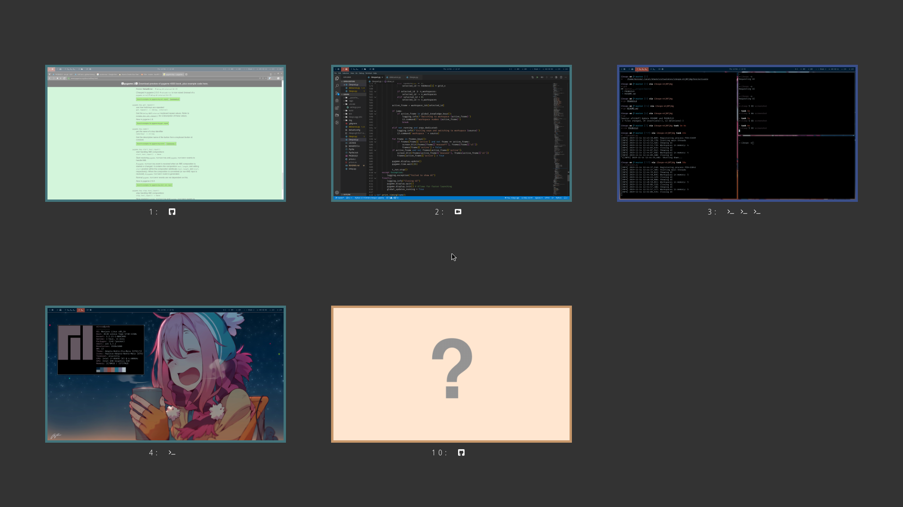

# Overwiew

i3expo is an simple and straightforward way to get a visual impression of all your
current virtual desktops that many compositing window managers use. It's not a
very powerful approach, but a very intuitive one and especially fits workflows
that use lots of temporary windows or those in which the workspaces are mentally
arranged in a grid.

i3expo emulates that function within the limitations of a non-compositing window
manager. By listening to the IPC, it takes a screenshot whenever a window event
occurrs. Using to an extremely fast C library, this produces negligible
overhead in normal operation and allows the script to remember what state you
left a workspace in.

The script is run as a background process and reacts to signals in order to open
its UI in which you get an overview of the known state of your workspaces and
can select another with the mouse or keyboard.

This is based on the work of [David Reis](https://gitlab.com/d.reis) and [Laur Aliste](https://gitlab.com/laur891).

Example output:


# Installation

## Instructions for Arch Linux:

An installation package is available in the AUR as [i3expo](https://aur.archlinux.org/packages/i3expo), which can be installed with your favourite helper

```
yay -S i3expo
```

## Manual installation

Clone, build and install

```
git clone https://github.com/mihalea/i3expo
cd i3expo
sudo python setup.py install
```

Compile `prtscn.c` and copy files to `/usr/share/i3expo`:

```
gcc -shared -O3 -Wall -fPIC -Wl,-soname,prtscn -o package/prtscn.so prtscn.c -lX11
sudo mkdir /usr/share/i3expo
sudo cp defaultconfig /usr/share/i3expo/defaultconfig
sudo cp package/prtscn.so /usr/share/i3expo/prtscn.so
```

## Dependencies

A minimum version of Python 3.6 is required to run this application, as it does not support any older versions.

The following Python packages are required to run this application:

- [pyxdg](https://pypi.org/project/pygame/)
- [i3ipc](https://pypi.org/project/i3ipc/)
- [pygame](https://pypi.org/project/pyxdg/)

# Usage

## Quick start

```
// Start the daemon
$ i3expo-daemon

// Show the UI
$ i3expo -s
```

## Configuration

A default config will be copied to `~/.config/i3expo/config` if not found when
the application is first started. `None` or invalid values will usually
(when `ConfigParser` throws a `ValueError`) be interpreted as "use the default".
Colors can be specified by using their PyGame names or in #fff or #ffffff hex.

### Daemon: `i3expod`

```
usage: i3expo-daemon [-h] [-v] [-i INTERVAL] [-d] [-t]

Display an overview of all open workspaces

optional arguments:
  -h, --help            show this help message and exit
  -v, --verbose         Print more program data
  -i INTERVAL, --interval INTERVAL
                        Update interval in seconds (default: 1s)
  -d, --dedicated       Launch on a dedicated workspace
```

### Client: `i3expo`

```
usage: i3expo [-h] [-u] [-s]

Interact with the i3expo daemon

optional arguments:
  -h, --help           show this help message and exit
  -u, --update-config  Update config from file
  -s, --show           Show expo UI
```

Aftering displaying the UI, it can be navigated with the mouse or with they keyboard using the arrow keys or hjkl, and Return to select and Escape to exit.

# Security

No screenshots are being saved on disk, and they are only available in the memory of the program. Python doesn't provide low level control over memory, screenshot data is being handled by the Python Garbage Collector. However, normal usage shouldn't be affected by this, as the kernel prevents processes from accessing memory not allocated to them.

# Limitations

Since it works by taking screenshots, the application cannot know workspaces it
hasn't seen yet. Furthermore, the updates are less continuous than you might be
used to if you're coming from a compositing WM where they can happen live and in the background.

# Credit

Stackoverflow user JHolta for the screenshot library to be found in this thread:
https://stackoverflow.com/questions/69645/take-a-screenshot-via-a-python-script-linux
